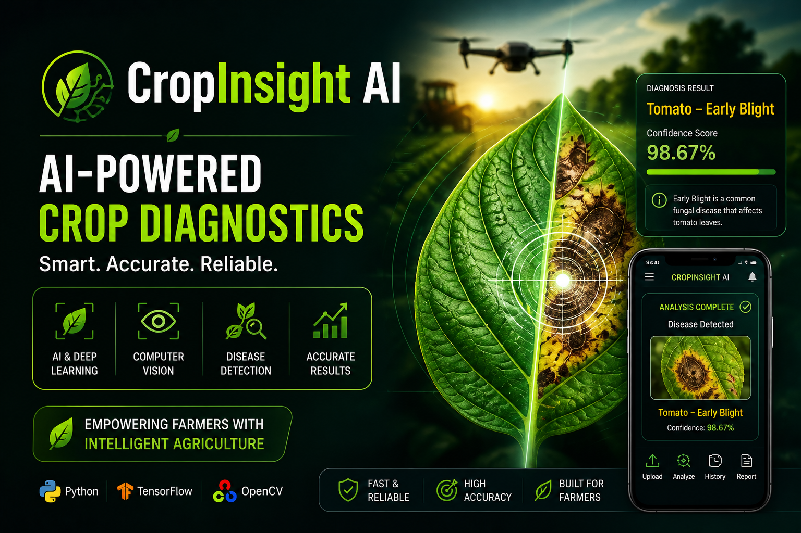

# 🌿 CropInsight AI — AI-Powered Crop Diagnostics
<p align="center">
  
  
  
  
</p>

<p align="center">
  
</p>

---

## 🚀 Overview
CropInsight AI is an intelligent crop disease detection system that uses Deep Learning and Computer Vision to analyze plant leaf images and identify diseases. It helps enable smart agriculture through fast, automated and reliable crop health diagnostics.
> A real-world AI application designed to assist farmers in early disease detection and improve agricultural productivity.
---

## 🧠 Key Features
- Image-based crop disease detection  
- Deep Learning model (MobileNetV2)  
- Fast inference using TensorFlow Lite  
- Web interface using FastAPI  
- Real-time prediction with confidence score  
- Treatment suggestions for diseases  

---

## 🏗️ Tech Stack
- Python  
- TensorFlow / Keras  
- TensorFlow Lite  
- FastAPI  
- HTML / CSS / JavaScript  

---

## 📁 Project Structure
```
CropInsight-AI/
├── main.py
├── config.py
├── requirements.txt
├── verify_setup.py
├── static/
│   └── index.html
├── models/
│   └── crop_dignostic_edge_model.tflite
└── README.md
```

---

## ⚙️ Setup Instructions

### 1. Clone the repository
```bash
git clone https://github.com/asnamarrium/cropinsight-ai.git
cd cropinsight-ai
```

### 2. Install dependencies
```bash
pip install -r requirements.txt
```

### 3. Run the application
```bash
uvicorn main:app --reload
```

### 4. Open in browser
```
http://127.0.0.1:8000
```

---

## 📦 Dataset
Dataset is not included due to large size.  
Use PlantVillage dataset and place it here:

```
dataset/plantvillage dataset/color
```

---

## 🧪 Model Details
- MobileNetV2 (Transfer Learning)
- Converted to TensorFlow Lite for fast inference

---

## 📈 Future Improvements
- Improve model accuracy  
- Add real-time camera detection  
- Deploy to cloud  
- Enhance UI/UX  

---

## 👨‍💻 Author
Developed by **Asna Marrium**

---

## ⭐ Support
If you like this project, give it a ⭐ on GitHub!
